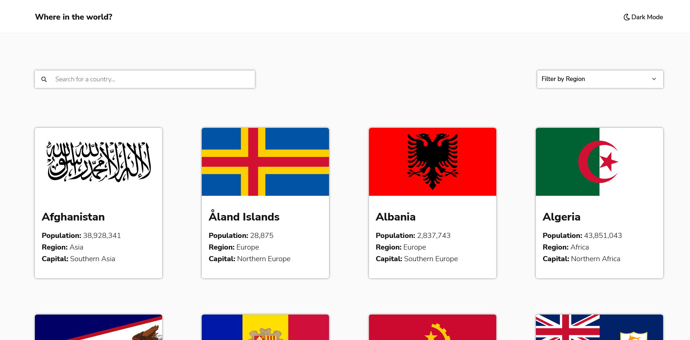
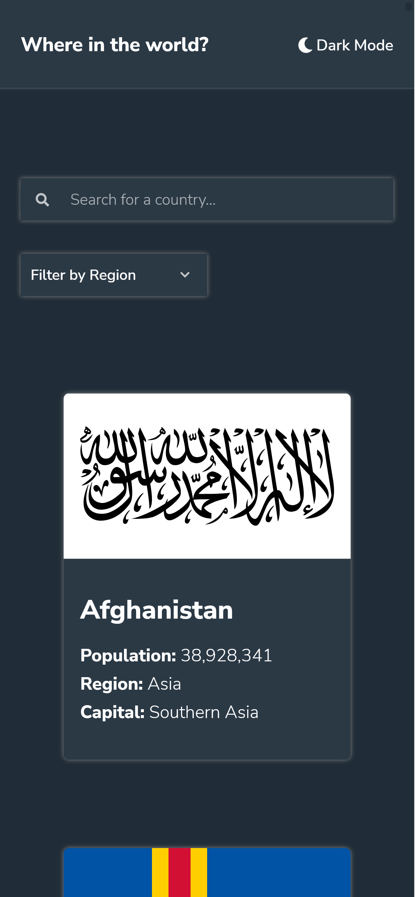

# Frontend Mentor - REST Countries API with color theme switcher solution

This is a solution to the [REST Countries API with color theme switcher challenge on Frontend Mentor](https://www.frontendmentor.io/challenges/rest-countries-api-with-color-theme-switcher-5cacc469fec04111f7b848ca). Frontend Mentor challenges help you improve your coding skills by building realistic projects. 

## Table of contents

- [Overview](#overview)
  - [The challenge](#the-challenge)
  - [Screenshot](#screenshot)
  - [Links](#links)
- [My process](#my-process)
  - [Built with](#built-with)
  - [What I learned](#what-i-learned)
  - [Continued development](#continued-development)
  - [Useful resources](#useful-resources)
- [Author](#author)

## Overview

### The challenge

Users should be able to:

- See all countries from the API on the homepage
- Search for a country using an `input` field
- Filter countries by region
- Click on a country to see more detailed information on a separate page
- Click through to the border countries on the detail page
- Toggle the color scheme between light and dark mode *(optional)*

### Screenshot




## My process

### Built with

- Semantic HTML5 markup
- CSS custom properties
- Flexbox
- CSS Grid

### What I learned

- This is my first time working with external API, so learned a lot about APIs
- Asynchronous behavior

```js
async function fectchAPI(){
    const baseURL = 'https://restcountries.com/v2/all';
    const response = await fetch(baseURL);
    const data = await response.json();

    renderHome(data);
    document.querySelector('.loader').classList.add('hidden');
    searchInputRender(data);
    filterRender(data);
}

```

### Continued development

I plan to add a feature where data will be loaded dynamically as the user scrolls down the page, this will load the site much faster.

### Useful resources

- [Recipe App](https://www.youtube.com/watch?v=x8EY0BlhPGk&t=2760s) - This video demonstrates very well how to use an external API.

## Author

- Website - [Soumya Banerjee](https://soumya495.github.io/Soumya-Banerjee/)
- Frontend Mentor - [@soumya495](https://www.frontendmentor.io/profile/soumya495)
- LinkedIn - [LinkedIn](https://www.linkedin.com/in/soumya-banerjee-94428a1a1/)
